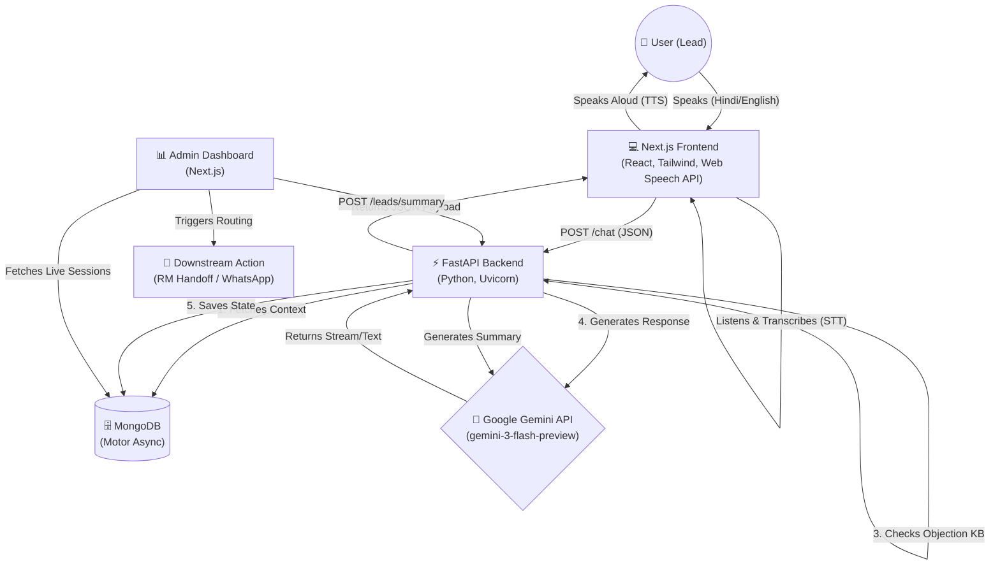
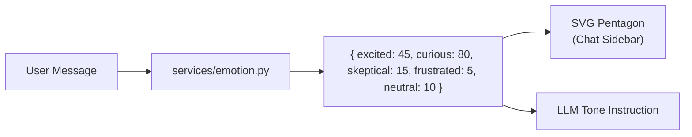
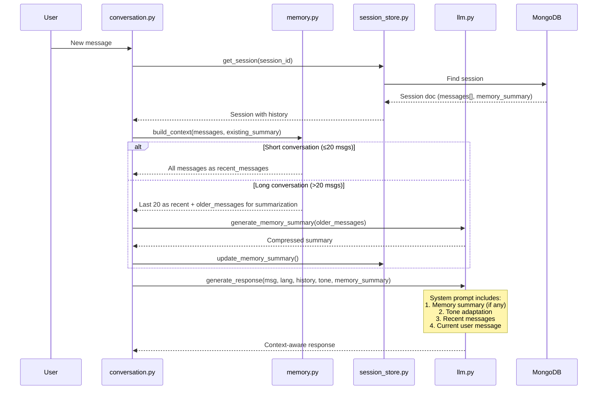

# Saarthi.AI - System Architecture & Documentation

This document provides a comprehensive overview of the **Saarthi.AI Multilingual Partner Acquisition Engine**. It is designed to help hackathon judges, developers, and product managers understand exactly how the system works under the hood.

---

## 1. High-Level Architecture

Saarthi.AI operates on a decoupled client-server architecture, communicating via asynchronous REST APIs. The frontend acts as the sensory input (Voice/Text), the FastAPI backend acts as the brain (Orchestration/NLP), and MongoDB acts as the memory (State/Context).



---

## 2. Core Components

### 🖥️ Frontend (Next.js 16 + Tailwind CSS)
* **Web Speech API**: Uses the native browser `SpeechRecognition` to instantly transcribe spoken Hinglish/Hindi/English without needing a costly cloud STT provider. Uses `speechSynthesis` to speak responses back.
* **Glassmorphism UI**: Built with Tailwind CSS, utilizing a premium "OLED Emerald" theme. Includes complex micro-animations (CSS waveforms, pulsing buttons, slide-up panels).
* **Real-time State**: Uses React Hooks to dynamically display Lead Classification (Hot/Warm/Cold) and Lead Score as the conversation occurs.

### ⚙️ Backend (FastAPI + Python)
* **Async Orchestration**: Fully asynchronous using Python `async/await` to handle hundreds of concurrent leads without blocking.
* **Lead Qualification Engine (`services/lead_scorer.py`)**: Mathematically evaluates intent. Adds points for buying signals (e.g., "commission", "join") and subtracts points for rejections (e.g., "busy", "already have").
* **Language Router (`services/language.py`)**: Detects the incoming dialect (Devanagari Hindi, Latin Hinglish, or Pure English) and instructs the LLM to mirror the tone perfectly.

### 🗄️ Database (MongoDB)
* **Session Memory (`services/session_store.py`)**: Every chat assigns a unique `session_id`. All messages, intent scores, and metadata are appended to the document, allowing users to drop off and return later seamlessly.
* **Memory Summaries**: For long conversations, compressed memory summaries are stored as a `memory_summary` field on the session document, ensuring context persists across sessions without re-processing the full history.

---

## 3. The 3-Layer Anti-Hallucination Strategy
In financial services, AI hallucinations are a critical liability. We built a robust safeguard system:

1. **The Deterministic KB (`data/objections.json`)**: Before hitting the LLM, inputs are scanned. If a user raises a core objection (e.g., "I am with a competitor"), the system overrides the LLM and returns a hardcoded, legally compliant Rupeezy rebuttal.
2. **Strict Guardrails**: The Gemini system prompt strictly forbids generating false commission structures or giving investment advice.
3. **RM Handoff Safety Net**: The AI is forbidden from finalizing onboarding. Its only job is to qualify. Once a lead hits a `Score > 60` (Hot), it terminates the pitch and triggers an RM handover.

---

## 4. Analytics & Routing (Dashboard)
The `/dashboard` route is the command center for Relationship Managers (RMs):
* **Funnel Analytics**: Live calculation of Total Contacted, Hot, Warm, and Cold leads.
* **Generative Summaries**: Instead of forcing RMs to read 50-message transcripts, a click sends the entire transcript to Gemini to extract: *Recommended Action, Topics Covered, and Objections Raised*.
* **Export to CRM**: Downloads a structured `.txt` report (session metadata + AI summary + full transcript) for CRM ingestion.
* **Sentiment Badges**: Each user message is scanned and tagged with a colored "High Intent" or "Objection" badge, so RMs can skim transcripts instantly.
* **Routing Simulator**: Evaluates the `score` and simulates sending an API payload to the CRM (e.g., dropping Warm leads into a WhatsApp nurture sequence).

---

## 5. Live Emotion Radar (Unique Differentiator)
This is the feature no other team has. Every user message is analyzed by `services/emotion.py` across **5 emotional axes**:

| Axis | Triggers | Effect |
|------|----------|--------|
| Excited | "yes", "join", "interested", "bahut accha" | AI becomes upbeat, moves towards closing |
| Curious | "how", "what", "kitna", "?" | AI becomes informative, gives clear facts |
| Skeptical | "but", "really", "compare", "zerodha" | AI becomes empathetic, provides proof |
| Frustrated | "no", "stop", "busy", "bakwas" | AI softens tone, stops pushing |
| Neutral | (baseline) | AI stays warm and professional |

The frontend renders this as a **live SVG pentagon radar chart** that smoothly animates with CSS transitions (`duration-700ms`) as the polygon shape morphs with each new message.



---

## 6. Conversation Memory & Context System

The Conversation Memory system (`services/memory.py`) ensures the AI agent never "forgets" what the user said earlier. This is critical for natural, multi-turn conversations where the user shares personal information (name, location, preferences) early on and expects the agent to remember it.

### How It Works

| Conversation Length | Strategy | What Happens |
|---|---|---|
| ≤ 20 messages | **Full Context** | All messages sent directly to Gemini as conversation history |
| > 20 messages | **Summary + Recent** | Older messages compressed into a memory summary; only last 20 sent as full context |
| > 25 messages | **Auto Re-summarize** | Memory summary refreshed every 10 messages to stay current |

### Architecture



### What Gets Remembered
The memory system captures and preserves:
* **Personal details**: Name, location, company, role
* **Preferences**: Budget, interests, requirements
* **Decisions**: What the user agreed to, objections raised
* **Conversation flow**: Topics discussed, questions asked

---

## 7. API Reference

| Method | Endpoint | Description | Returns |
|--------|----------|-------------|---------|
| `POST` | `/chat` | Send a user message, get AI response | `session_id`, `response`, `score`, `classification`, `emotion` |
| `GET` | `/leads` | List all lead sessions (without messages) | Array of session summaries |
| `GET` | `/leads/{session_id}` | Get full session detail with transcript | Full session object |
| `POST` | `/leads/{session_id}/route` | Simulate CRM routing for a lead | Routing payload (action, priority, RM) |
| `POST` | `/leads/{session_id}/summary` | Generate AI post-call summary | Objections, topics, recommended action |

---

## 8. Folder Structure
```text
sarti-ai-hacakethon/
│
├── frontend/                   # Next.js UI Application
│   ├── src/app/
│   │   ├── page.js             # Landing Page (React Icons)
│   │   ├── globals.css         # OLED Emerald Theme & Animations
│   │   ├── chat/page.js        # Voice Agent + Emotion Radar
│   │   └── dashboard/page.js   # Analytics + CRM Export + Sentiment
│   └── package.json            # React, Tailwind, React-Icons
│
├── backend/                    # FastAPI Microservice
│   ├── main.py                 # App Entrypoint & CORS
│   ├── routers/
│   │   ├── chat.py             # Message Ingestion + Emotion
│   │   ├── leads.py            # Summary Generation & Routing
│   │   └── schemas.py          # Pydantic Request/Response Models
│   ├── services/
│   │   ├── llm.py              # Gemini 3 Flash Integration (with memory)
│   │   ├── memory.py           # Conversation Memory & Context Manager
│   │   ├── emotion.py          # 5-Axis Emotion Detection Engine
│   │   ├── lead_scorer.py      # Math-based intent evaluation
│   │   ├── language.py         # Hindi/Hinglish/English detection
│   │   ├── conversation.py     # Orchestration pipeline (memory-aware)
│   │   └── session_store.py    # MongoDB Async connector + Memory persistence
│   ├── data/
│   │   └── objections.json     # Anti-hallucination KB
│   └── .env                    # Secrets (MongoDB URL, Gemini API Key)
│
├── ARCHITECTURE.md             # This file
└── README.md                   # Quickstart Guide
```

