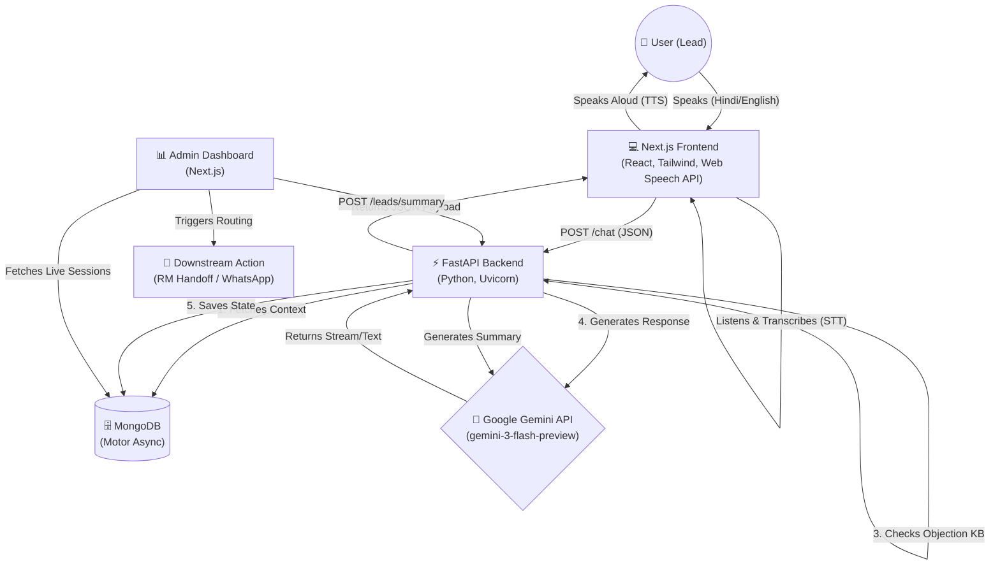

# Saarthi.AI - System Architecture & Documentation

This document provides a comprehensive overview of the **Saarthi.AI Multilingual Partner Acquisition Engine**. It is designed to help hackathon judges, developers, and product managers understand exactly how the system works under the hood.

---

## 1. High-Level Architecture

Saarthi.AI operates on a decoupled client-server architecture, communicating via asynchronous REST APIs. The frontend acts as the sensory input (Voice/Text), the FastAPI backend acts as the brain (Orchestration/NLP), and MongoDB acts as the memory (State/Context).



---

## 2. Core Components

### 🖥️ Frontend (Next.js 16 + Tailwind CSS)
* **Web Speech API**: Uses the native browser `SpeechRecognition` to instantly transcribe spoken Hinglish/Hindi/English without needing a costly cloud STT provider. Uses `speechSynthesis` to speak responses back.
* **Glassmorphism UI**: Built with Tailwind CSS, utilizing a premium "OLED Emerald" theme. Includes complex micro-animations (CSS waveforms, pulsing buttons, slide-up panels).
* **Real-time State**: Uses React Hooks to dynamically display Lead Classification (Hot/Warm/Cold) and Lead Score as the conversation occurs.

### ⚙️ Backend (FastAPI + Python)
* **Async Orchestration**: Fully asynchronous using Python `async/await` to handle hundreds of concurrent leads without blocking.
* **Lead Qualification Engine (`services/lead_scorer.py`)**: Mathematically evaluates intent. Adds points for buying signals (e.g., "commission", "join") and subtracts points for rejections (e.g., "busy", "already have").
* **Language Router (`services/language.py`)**: Detects the incoming dialect (Devanagari Hindi, Latin Hinglish, or Pure English) and instructs the LLM to mirror the tone perfectly.

### 🗄️ Database (MongoDB)
* **Session Memory (`services/session_store.py`)**: Every chat assigns a unique `session_id`. All messages, intent scores, and metadata are appended to the document, allowing users to drop off and return later seamlessly.

---

## 3. The 3-Layer Anti-Hallucination Strategy
In financial services, AI hallucinations are a critical liability. We built a robust safeguard system:

1. **The Deterministic KB (`data/objections.json`)**: Before hitting the LLM, inputs are scanned. If a user raises a core objection (e.g., "I am with a competitor"), the system overrides the LLM and returns a hardcoded, legally compliant Rupeezy rebuttal.
2. **Strict Guardrails**: The Gemini system prompt strictly forbids generating false commission structures or giving investment advice.
3. **RM Handoff Safety Net**: The AI is forbidden from finalizing onboarding. Its only job is to qualify. Once a lead hits a `Score > 60` (Hot), it terminates the pitch and triggers an RM handover.

---

## 4. Analytics & Routing (Dashboard)
The `/dashboard` route is the command center for Relationship Managers (RMs):
* **Funnel Analytics**: Live calculation of Total Contacted, Hot, Warm, and Cold leads.
* **Generative Summaries**: Instead of forcing RMs to read 50-message transcripts, a click sends the entire transcript to Gemini to extract: *Recommended Action, Topics Covered, and Objections Raised*.
* **Routing Simulator**: Evaluates the `score` and simulates sending an API payload to the CRM (e.g., dropping Warm leads into a WhatsApp nurture sequence).

---

## 5. Folder Structure
```text
sarti-ai-hacakethon/
│
├── frontend/                   # Next.js UI Application
│   ├── src/app/
│   │   ├── page.js             # Landing Page
│   │   ├── globals.css         # Theme & Animation Definitions
│   │   ├── chat/page.js        # The Live Voice Agent Interface
│   │   └── dashboard/page.js   # Analytics & CRM Routing Dashboard
│   └── package.json            # React, Tailwind, React-Icons
│
├── backend/                    # FastAPI Microservice
│   ├── main.py                 # App Entrypoint & CORS
│   ├── routers/
│   │   ├── chat.py             # Message Ingestion
│   │   └── leads.py            # Summary Generation & Routing
│   ├── services/
│   │   ├── llm.py              # Gemini 3 Flash Integration
│   │   ├── lead_scorer.py      # Math-based intent evaluation
│   │   └── session_store.py    # MongoDB Async connector
│   ├── data/
│   │   └── objections.json     # Anti-hallucination KB
│   └── .env                    # Secrets (MongoDB URL, Gemini API Key)
│
└── README.md                   # Quickstart Guide
```
