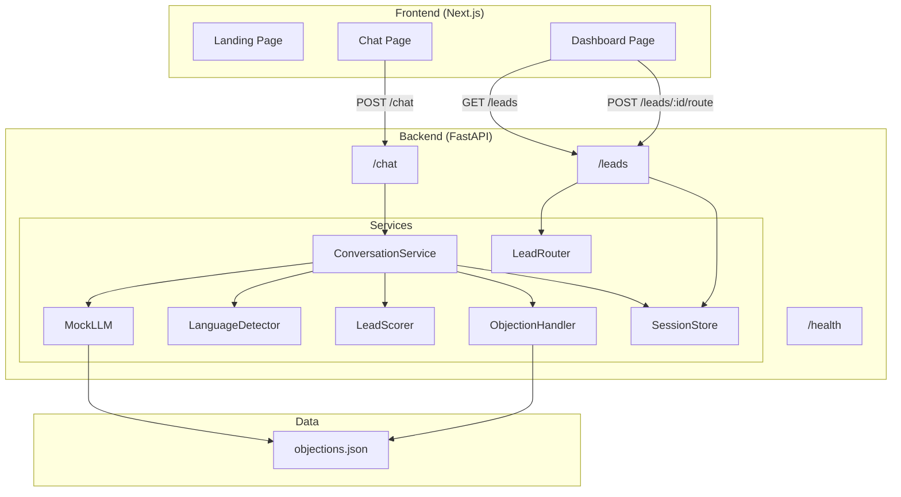

# Saarthi.AI – Multilingual Partner Acquisition Engine

Build a demo-ready prototype that handles inbound leads via text/voice, supports multilingual/Hinglish conversations, qualifies leads (Hot/Warm/Cold), and simulates routing to RM or WhatsApp.

## Existing State

| Layer | Status |
|-------|--------|
| **Frontend** | Next.js 16 + Tailwind v4 scaffolded, "hello world" page only |
| **Backend** | Empty folder with `.gitignore` only |
| **Database** | None configured |

---

## User Review Required

> [!IMPORTANT]
> **LLM Provider**: The plan uses a **mock LLM** by default (pattern-matching + templated responses) so the demo runs without any API key. If you have a **Google Gemini / OpenAI** API key and want real LLM responses, let me know and I'll wire it in instead of (or alongside) the mock.

> [!IMPORTANT]
> **Database**: The plan uses **in-memory storage** (Python dicts) for sessions, which means data resets on server restart. This keeps the demo zero-dependency. If you'd prefer MongoDB, let me know.

> [!IMPORTANT]
> **Tailwind v4**: The frontend already uses Tailwind v4 (via `@tailwindcss/postcss`). I will continue using Tailwind for styling since it's already configured, rather than vanilla CSS.

---

## Open Questions

1. **API Key**: Do you have a Gemini or OpenAI key you want to use, or is mock LLM fine for the demo?
2. **MongoDB**: Should I wire up MongoDB, or is in-memory storage acceptable for this prototype?
3. **Deploy target**: Any specific deployment target (Vercel, Railway, etc.) or is local-only fine?

---

## Proposed Changes

### Phase 1: Project Setup & Backend Foundation

#### [NEW] [main.py](file:///c:/Users/chend/OneDrive/Desktop/sarti-ai-hacakethon/backend/main.py)
- FastAPI application entry point
- CORS middleware (allow frontend on port 3000)
- Health check endpoint `GET /health`
- Include all routers

#### [NEW] [config.py](file:///c:/Users/chend/OneDrive/Desktop/sarti-ai-hacakethon/backend/config.py)
- Settings via `pydantic-settings` (reads `.env`)
- `LLM_PROVIDER`, `LLM_API_KEY`, `FRONTEND_URL`

#### [NEW] [.env.example](file:///c:/Users/chend/OneDrive/Desktop/sarti-ai-hacakethon/backend/.env.example)
- Template environment variables

#### [NEW] [requirements.txt](file:///c:/Users/chend/OneDrive/Desktop/sarti-ai-hacakethon/backend/requirements.txt)
- FastAPI, uvicorn, pydantic-settings, python-dotenv

---

### Phase 2: Chat API & Conversation Engine

#### [NEW] [routers/chat.py](file:///c:/Users/chend/OneDrive/Desktop/sarti-ai-hacakethon/backend/routers/chat.py)
- `POST /chat` — accepts `{ session_id, message }`, returns `{ response, score, classification, session_id }`
- Creates new session if `session_id` is null

#### [NEW] [routers/__init__.py](file:///c:/Users/chend/OneDrive/Desktop/sarti-ai-hacakethon/backend/routers/__init__.py)

#### [NEW] [services/conversation.py](file:///c:/Users/chend/OneDrive/Desktop/sarti-ai-hacakethon/backend/services/conversation.py)
- `ConversationService` class
- Orchestrates: language detection → LLM response → lead scoring → session update
- Maintains conversation history per session

#### [NEW] [services/llm.py](file:///c:/Users/chend/OneDrive/Desktop/sarti-ai-hacakethon/backend/services/llm.py)
- `MockLLM` class with pattern-matching + templated contextual responses
- Handles greeting, pitch, objections, interest signals, rejection
- Returns Hinglish-style responses naturally
- Interface ready for swap to real LLM

#### [NEW] [services/__init__.py](file:///c:/Users/chend/OneDrive/Desktop/sarti-ai-hacakethon/backend/services/__init__.py)

---

### Phase 3: Language Detection & Hinglish

#### [NEW] [services/language.py](file:///c:/Users/chend/OneDrive/Desktop/sarti-ai-hacakethon/backend/services/language.py)
- Heuristic language detector (Hindi chars = Hindi, mixed = Hinglish, else English)
- Returns detected language so LLM can mirror style
- Simple, no external API needed

---

### Phase 4: Lead Qualification Engine

#### [NEW] [services/lead_scorer.py](file:///c:/Users/chend/OneDrive/Desktop/sarti-ai-hacakethon/backend/services/lead_scorer.py)
- `LeadScorer` class
- Keyword-based scoring:
  - Interest signals: `+10` to `+20` (e.g., "interested", "tell me more", "how to join", "commission")
  - Rejection signals: `-10` to `-15` (e.g., "not interested", "already have broker", "no time")
  - Neutral: `+3` (engagement bonus)
- Classification: Hot (>75), Warm (40–75), Cold (<40)
- Score clamped to 0–100

---

### Phase 5: Objection Handling Knowledge Base

#### [NEW] [data/objections.json](file:///c:/Users/chend/OneDrive/Desktop/sarti-ai-hacakethon/backend/data/objections.json)
- JSON knowledge base mapping common objections to contextual responses:
  - "already have broker" → higher brokerage share, better tech
  - "no time" → minimal effort, automated tools
  - "not interested" → soft re-pitch with success stories
  - "too risky" → support system, training provided
  - "low commission" → competitive rates breakdown
  - ~8-10 objection patterns total

#### [NEW] [services/objection_handler.py](file:///c:/Users/chend/OneDrive/Desktop/sarti-ai-hacakethon/backend/services/objection_handler.py)
- Fuzzy keyword matching against objections.json
- Returns context-aware response snippets for the LLM to weave into replies
- Not rigid scripts — provides talking points

---

### Phase 6: Session Store (Multi-Turn Memory)

#### [NEW] [services/session_store.py](file:///c:/Users/chend/OneDrive/Desktop/sarti-ai-hacakethon/backend/services/session_store.py)
- In-memory session store (Python dict)
- Each session: `{ id, messages[], score, classification, language, created_at, updated_at }`
- `get_session()`, `create_session()`, `update_session()`
- Session persists across requests (user can refresh)

---

### Phase 7: Lead Routing Simulation

#### [NEW] [routers/leads.py](file:///c:/Users/chend/OneDrive/Desktop/sarti-ai-hacakethon/backend/routers/leads.py)
- `GET /leads` — returns all sessions with their status
- `GET /leads/{session_id}` — returns full session detail + summary
- `POST /leads/{session_id}/route` — simulates routing:
  - Hot → returns RM assignment JSON + summary
  - Warm → returns simulated WhatsApp message payload
  - Cold → returns "nurture" status

#### [NEW] [services/lead_router.py](file:///c:/Users/chend/OneDrive/Desktop/sarti-ai-hacakethon/backend/services/lead_router.py)
- Generates structured lead summary JSON
- Simulates RM notification / WhatsApp payload

---

### Phase 8 (Frontend): Premium Chat Interface + Dashboard

#### [MODIFY] [layout.js](file:///c:/Users/chend/OneDrive/Desktop/sarti-ai-hacakethon/frontend/src/app/layout.js)
- Update metadata (title, description for SEO)
- Add Inter font from Google Fonts alongside Geist

#### [MODIFY] [globals.css](file:///c:/Users/chend/OneDrive/Desktop/sarti-ai-hacakethon/frontend/src/app/globals.css)
- Add CSS custom properties for dark theme color system
- Define animations (fade-in, slide-up, pulse)
- Base styles for scrollbars, focus rings, etc.

#### [MODIFY] [page.js](file:///c:/Users/chend/OneDrive/Desktop/sarti-ai-hacakethon/frontend/src/app/page.js)
- Landing page with:
  - Hero section with gradient background + animated particles
  - "Start Chat" CTA button → navigates to `/chat`
  - "View Dashboard" link → navigates to `/dashboard`
  - Feature cards (Multilingual, Lead Scoring, Smart Routing)

#### [NEW] [chat/page.js](file:///c:/Users/chend/OneDrive/Desktop/sarti-ai-hacakethon/frontend/src/app/chat/page.js)
- Full chat interface (client component):
  - Dark glassmorphism chat panel
  - Message bubbles (user = right, AI = left) with timestamps
  - Typing indicator animation
  - Lead score badge (live-updating, color-coded Hot/Warm/Cold)
  - Input bar with send button + optional mic button
  - Session persistence via `sessionStorage`
  - Voice input toggle (Phase 8 — browser SpeechRecognition API)
  - Voice output toggle (Phase 8 — browser SpeechSynthesis API)

#### [NEW] [dashboard/page.js](file:///c:/Users/chend/OneDrive/Desktop/sarti-ai-hacakethon/frontend/src/app/dashboard/page.js)
- Lead management dashboard:
  - Stats cards (Total Leads, Hot, Warm, Cold counts)
  - Lead table with columns: Session ID, Language, Score, Classification, Last Active
  - Click lead → expand to see summary + conversation excerpt
  - "Route Lead" button → calls `/leads/{id}/route`, shows result modal
  - Color-coded classification badges

#### [NEW] [components/ChatMessage.js](file:///c:/Users/chend/OneDrive/Desktop/sarti-ai-hacakethon/frontend/src/app/components/ChatMessage.js)
- Individual message bubble component
- Supports user/AI variants with different styling
- Timestamp display

#### [NEW] [components/LeadBadge.js](file:///c:/Users/chend/OneDrive/Desktop/sarti-ai-hacakethon/frontend/src/app/components/LeadBadge.js)
- Color-coded badge: 🔥 Hot (red/orange), 🌤️ Warm (amber), ❄️ Cold (blue)
- Animated transitions between states

#### [NEW] [components/Navbar.js](file:///c:/Users/chend/OneDrive/Desktop/sarti-ai-hacakethon/frontend/src/app/components/Navbar.js)
- Top navigation bar with Saarthi.AI branding
- Links to Chat and Dashboard
- Glassmorphism style

#### [NEW] [lib/api.js](file:///c:/Users/chend/OneDrive/Desktop/sarti-ai-hacakethon/frontend/src/app/lib/api.js)
- API utility functions wrapping `fetch` calls to backend
- `sendMessage()`, `getLeads()`, `getLeadDetail()`, `routeLead()`

---

## Architecture Diagram

---

## Design Aesthetic

The frontend will feature:
- **Dark theme** with deep navy/slate backgrounds
- **Glassmorphism** panels with frosted glass effects
- **Gradient accents** (violet → cyan for primary, orange → red for hot leads)
- **Micro-animations**: fade-in messages, pulse on new score, smooth transitions
- **Premium typography**: Inter/Geist font pairing
- **Responsive**: works on desktop and mobile

---

## Verification Plan

### Automated Tests
1. `curl http://localhost:8000/health` → `{"status": "ok"}`
2. `curl -X POST http://localhost:8000/chat -d '{"message": "hello"}'` → valid JSON response
3. `curl -X POST http://localhost:8000/chat -d '{"message": "mera broker better hai", "session_id": "..."}'` → Hinglish response + score change
4. `curl http://localhost:8000/leads` → list of sessions
5. Frontend browser test: navigate through Landing → Chat → Dashboard flow

### Manual Verification
- Chat in English, Hindi, and Hinglish — verify responses mirror language
- Express interest → verify score increases → reaches Hot
- Express objections → verify contextual counter-responses
- Check dashboard shows all leads with correct classifications
- Route a Hot lead → verify RM assignment summary
- Route a Warm lead → verify WhatsApp simulation
- (Optional) Test voice input/output in browser
