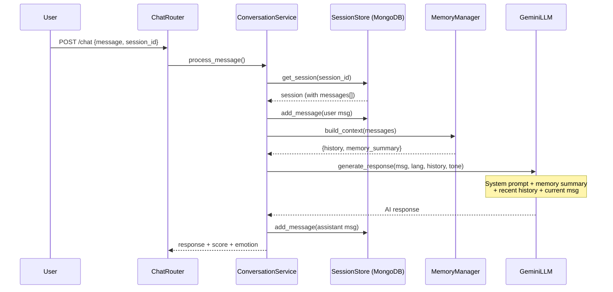

# Add Conversation Memory to Saarthi.AI Agent

## Problem

The agent has **zero memory** of past messages. Every time a user sends a message, `GeminiLLM.generate_response()` sends **only** the current message to Gemini:

```python
# llm.py line 51-53 — THIS is the root cause
contents=[system_prompt, f"User: {message}"]
```

Even though messages ARE saved to MongoDB via `session_store.add_message()`, they are **never retrieved and passed to the LLM**. So every response is generated in complete isolation.

## Proposed Changes

### 1. LLM Service — Feed conversation history to Gemini

#### [MODIFY] [llm.py](file:///c:/Users/chend/OneDrive/Desktop/sarti-ai-hacakethon/backend/services/llm.py)

- Change `generate_response(message, language)` → `generate_response(message, language, history=None)`
- Build proper Gemini multi-turn `contents` list from the conversation history
- Include the system prompt, then all prior user/assistant messages, then the current user message
- This gives Gemini full context of the conversation

**Before:**
```python
contents=[system_prompt, f"User: {message}"]
```

**After:**
```python
contents = [system_prompt]
# Add conversation history (last N messages)
for msg in history[-MAX_HISTORY:]:
    contents.append(f"{msg['role'].upper()}: {msg['content']}")
# Add current message
contents.append(f"User: {message}")
```

- Also integrate the **emotion tone instruction** into the system prompt (currently unused — `emotion_detector.get_tone_instruction()` exists but is never called)
- Add `MAX_HISTORY_MESSAGES = 20` constant to cap context window usage

---

### 2. Conversation Orchestrator — Retrieve history and pass it to LLM

#### [MODIFY] [conversation.py](file:///c:/Users/chend/OneDrive/Desktop/sarti-ai-hacakethon/backend/services/conversation.py)

- After retrieving the session, extract `session["messages"]` (the full chat history from MongoDB)
- Pass `history` to `mock_llm.generate_response(message, lang, history=history)`
- Also pass the emotion `dominant` to get tone-adapted responses

**Key change:**
```python
# Get conversation history from the session
history = session.get("messages", [])

# Get tone instruction from emotion
tone = emotion_detector.get_tone_instruction(emotion_result["dominant"])

# Generate AI Response WITH memory
ai_response = mock_llm.generate_response(message, lang, history=history, tone=tone)
```

---

### 3. Memory Summarization — Handle long conversations

#### [NEW] [memory.py](file:///c:/Users/chend/OneDrive/Desktop/sarti-ai-hacakethon/backend/services/memory.py)

For conversations that exceed a threshold (e.g., 20 messages), we need a summarization strategy to avoid exceeding Gemini's context window and increasing latency/cost:

- `MemoryManager` class with:
  - `build_context(messages, max_recent=20)` — Returns the most recent N messages as direct history
  - `summarize_older(messages, max_recent=20)` — If there are more than N messages, uses Gemini to create a brief summary of the older messages and prepends it as a "memory context" to the system prompt
  - Stores the summary in the session document so it doesn't need to re-summarize each turn

This keeps the agent aware of early conversation topics (e.g., "I already told you my name is Rahul") without sending 100+ messages every API call.

---

### 4. Session Store — Add memory summary persistence

#### [MODIFY] [session_store.py](file:///c:/Users/chend/OneDrive/Desktop/sarti-ai-hacakethon/backend/services/session_store.py)

- Add `update_memory_summary(session_id, summary)` method to persist the compressed memory summary
- The summary gets stored as a `memory_summary` field on the session document

---

## Architecture Flow (After Changes)



## Verification Plan

### Automated Tests
1. Start the backend server: `python -m uvicorn main:app --port 8080`
2. Send a sequence of test messages via curl/browser:
   - Message 1: "Hi, my name is Rahul"
   - Message 2: "What is the commission structure?"
   - Message 3: "What's my name?"  ← **This should return "Rahul"** (proves memory works)
3. Verify that long conversations (20+ messages) get summarized properly

### Manual Verification
- Test via the frontend chat UI to confirm natural multi-turn conversations work
